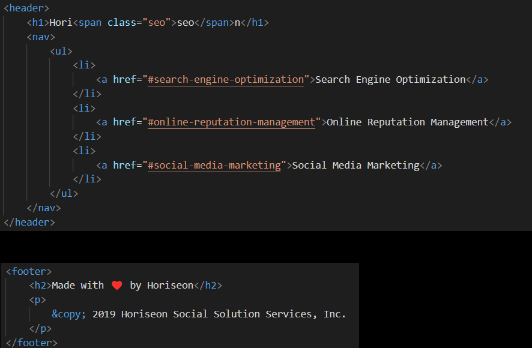
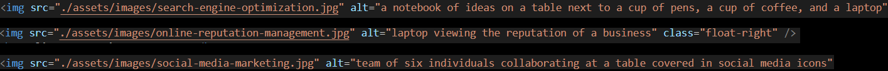

# Horiseon-Code-Refactor

## General Info
The aim of this project was to refactor the code for the Horiseon page provided and adjust the html and css files for better accessibility. 

## Title changes
Title of project was changed from "website" to "Horiseon Homepage" 

## Semantic element changes
- Changed basic 
 to <nav> and adjusted .css file accordingly (div became nav)

- Changed footer from 
 into element <footer>
- Changed header from 
 into element <header>

- Added header, nav, section, article, and footer semantics

## Alt attributes changes
- Added alt descriptions to images in Search Engine Optimization, Online Reputation Management, and Social Media Marketing sections.

- Added blank alt to icons

## Heading order changes
- added spaces between articles and sections for accessibility

## .CSS changes
- Created "benefit" class to group identical formatting of benefit-brand, benefit-cost, benefit-lead

- Created "feature" class to group identical formatting of search-engine-optimization, online-reputation-management, social-media-marketing

- Added hero background image from css to html as img src with added alt description

